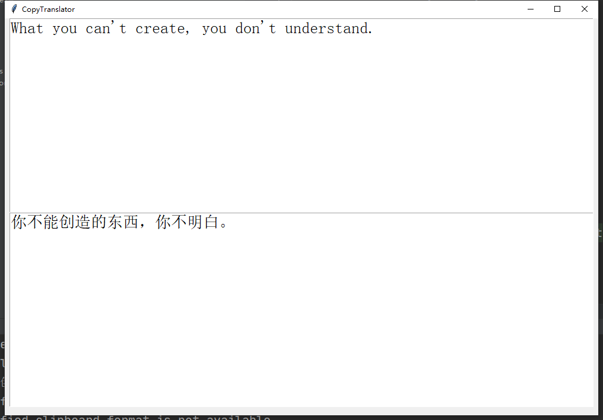

# CopyTranslator

Translate when you copy.

Only support windows now. Its stability depends on baidu api. It sometimes does not 
work because of some unknown internal error.
 
## How to
1. Download dependencies.
    ```shell script
    pip install -r requirements
    ``` 
2. Run it.
    ```shell script
    python run.py
    ```
3. Copy and translate.
## Screenshots

